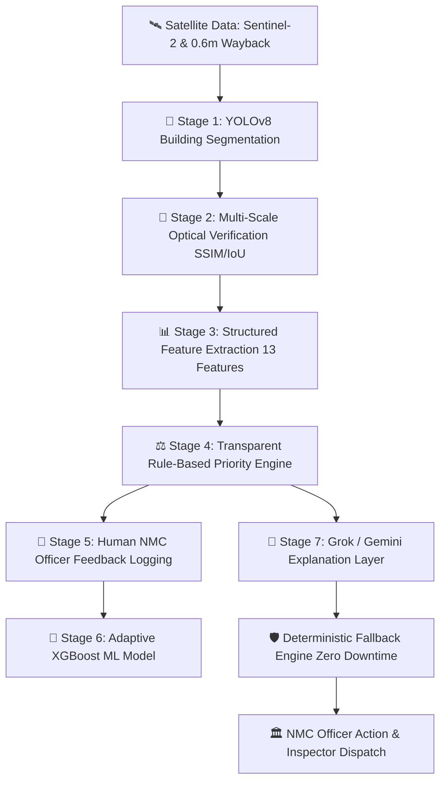

# 🛰️ NMC EarthWatch — Official Municipal GeoAI Decision-Support System
### *Automated Vigilance, Unauthorized Construction Detection & Property Tax Protection for Nagpur Municipal Corporation (NMC)*

[](http://localhost:5173)
[](#-nagpur-municipal-jurisdiction--ward-coverage)
[](http://localhost:5173)
[](#-6-stage-geoai-to-municipal-decision-chain)

---

## 🏆 Executive Summary: The NMC Municipal Imperative

**NMC EarthWatch** is an enterprise-grade GeoAI municipal intelligence portal engineered specifically for the **Nagpur Municipal Corporation (NMC) Town Planning & Vigilance Department**.

 Nagpur is expanding at an unprecedented rate across its $228 \text{ km}^2$ municipal boundary (MIHAN SEZ, Outer Ring Road, Hingna Industrial Belt, Laxmi Nagar). Manual ward-level physical inspection of every plot is humanly impossible, leading to:
1. 🏛️ **Unsanctioned Structural Emergence** — New buildings erected without NMC Town Planning sanction permits.
2. 💸 **Property Tax Revenue Leakage** — Unregistered built-up expansions escaping municipal assessment rolls.
3. ⏳ **Delayed Vigilance Action** — Inspection backlogs allowing unauthorized structures to reach completion.

**NMC EarthWatch** solves this by converting raw satellite change feeds into **10-Second Executive Action Dossiers** for NMC Officers.

```text
               NMC TOWN PLANNING OFFICER 10-SECOND CLARITY
┌────────────────────────────────────────────────────────────────────────┐
│ 🔴 HIGH PRIORITY  │  🏗️ NEW PHYSICAL STRUCTURE DETECTED                  │
│ Location: Ward 36 · Laxmi Nagar Zone (MIHAN SEZ Corridor)              │
├────────────────────────────────────────────────────────────────────────┤
│ WHAT HAPPENED?                                                         │
│ A new 1,812 px building footprint emerged in 2025 imagery with zero    │
│ baseline overlap in 2019 imagery (0.00 IoU).                           │
│                                                                        │
│ WHY FLAGGED FOR INSPECTION?                                            │
│ ✓ Large physical structure emergence (~1,812 px footprint)             │
│ ✓ Strong supporting imagery evidence (Multi-scale verified)            │
│ ✓ High municipal growth sensitivity corridor (Ward 36)                 │
│                                                                        │
│ RECOMMENDED MUNICIPAL ACTION:                                          │
│ 🏛️ FIELD INSPECTION REQUIRED (Cross-reference NMC sanction permits)    │
└────────────────────────────────────────────────────────────────────────┘
```

---

## 🏢 Core Municipal Use Cases & Revenue Impact

```text
                               ┌─────────────────────────────────────────┐
                               │     NMC EARTHWATCH GOVERNANCE ENGINE     │
                               └────────────────────┬────────────────────┘
                                                    │
         ┌──────────────────────────────────────────┼──────────────────────────────────────────┐
         ▼                                          ▼                                          ▼
┌─────────────────────────┐            ┌─────────────────────────┐            ┌─────────────────────────┐
│ 🏛️ VIGILANCE ENFORCEMENT │            │ 💸 PROPERTY TAX REVENUE │            │ 🗺️ TOWN PLANNING COMPLIANCE│
├─────────────────────────┤            ├─────────────────────────┤            ├─────────────────────────┤
│ Detects new physical    │            │ Flags unregistered      │            │ Prevents encroachment  │
│ building emergence early│            │ floor expansions for    │            │ on municipal green belts│
│ before completion.      │            │ tax assessment rolls.   │            │ and reservation plots.  │
└─────────────────────────┘            └─────────────────────────┘            └─────────────────────────┘
```

| Municipal Governance Need | Traditional Manual Approach | NMC EarthWatch Solution |
| :--- | :--- | :--- |
| **Vigilance Coverage** | Reactive field visits based on citizen complaints after construction is complete. | **Automated Proactive Surveillance** covering all 36 wards using 0.6m high-resolution satellite differencing. |
| **Evidence Quality** | Single photos with unverified dates or subjective inspector reports. | **Multi-Scale Evidence Matrix** fusing 10m Sentinel-2 multi-spectral deltas, 0.6m Wayback orthophotos, SSIM, and edge emergence. |
| **Tax Revenue Collection** | Annual manual self-assessments missing new additions. | **Automated Built-Up Area Quantification** calculating exact footprint area ($m^2$) for instant tax audit cross-referencing. |
| **Officer Usability** | Technical software displaying raw IoU, loss functions, and complex neural metrics. | **10-Second Executive Officer Dossier** presenting human-readable checklists, priority reasons, and 1-click inspector dispatch. |
| **Legal Safety** | Risks accusing citizens of "illegal" acts without permit validation. | **Strict Governance Guardrails**: Flags *physical structure emergence* while directing officers to cross-reference official NMC permit registers. |

---

## ⚡ 6-Stage GeoAI-to-Municipal Decision Chain



### Stage Breakdown:
1. **YOLOv8 Neural Segmentation**: Deep neural model segments individual building footprints across historical (2019) and current (2025) orthophotos.
2. **Multi-Scale Verification**: Computes spatial IoU overlap, structural similarity (SSIM divergence), and edge emergence to eliminate false alarms from shadows or vegetation.
3. **Structured Feature Extraction**: Converts raw imagery data into a 13-feature vector (`change_pixel_area`, `yolo_confidence`, `iou`, `ssim_divergence`, `temporal_delta`, `sensitivity_score`, etc.).
4. **Rule-Based Priority Engine**: Evaluates municipal risk factors with transparent scoring rules (`CRITICAL`, `HIGH`, `MEDIUM`, `LOW`) and safety overrides (`NEEDS_REVIEW`).
5. **Officer Feedback & XGBoost Learning**: Persists human officer decisions (`CONFIRMED`, `FALSE_POSITIVE`, `NEEDS_REVIEW`) into [`outputs/officer_feedback.json`](file:///c:/Work/Nagpur_X/outputs/officer_feedback.json) to train an adaptive XGBoost model.
6. **LLM Explanation & Deterministic Fallback**: Converts technical outputs into plain-language officer guidance via Grok/Gemini API, backed by a local deterministic template generator that guarantees zero system downtime.

---

## 🗺️ Nagpur Municipal Jurisdiction & Ward Coverage

NMC EarthWatch is pre-calibrated with spatial boundaries and municipal sensitivity tiers across Nagpur Municipal Corporation zones:

| Zone ID | Administrative Zone | Primary Monitored Corridors | Sensitivity Tier | Vigilance Priority |
| :---: | :--- | :--- | :---: | :---: |
| **Zone 1** | **Laxmi Nagar** | MIHAN SEZ Corridor, Outer Ring Road, Somalwada, AIIMS | `HIGH` | 🔴 CRITICAL |
| **Zone 2** | **Dharampeth** | Civil Lines, High Court, Secretariat Corridor, Ramdaspeth | `HIGH` | 🔴 CRITICAL |
| **Zone 3** | **Hanuman Nagar** | Manewada, Besa Road, Ayodhya Nagar Expansion | `MEDIUM` | 🟠 HIGH |
| **Zone 4** | **Dhantoli** | Sitabuldi Metro Interchange, Heritage Fort Zone | `HIGH` | 🔴 CRITICAL |
| **Zone 5** | **Nehrunagar** | Nandanvan Commercial & Educational Corridor | `MEDIUM` | 🟠 HIGH |
| **Zone 9** | **Satranjipura** | Sadar Commercial & Civil District | `HIGH` | 🔴 CRITICAL |

---

## 🏛️ Officer View vs. 🔬 Analyst View

NMC EarthWatch provides a tailored interface for both municipal executives and technical GIS specialists:

### 🏛️ Executive Officer View (Default)
- **Visual Evidence**: Side-by-side historical baseline vs current orthophoto with interactive split-slider.
- **10-Second Summary**: Highlighted change category, evidence strength badge (`🟢 STRONG`), recommended municipal action (`🏛️ FIELD INSPECTION REQUIRED`).
- **Human-Readable Checklist**: Bulleted reasons explaining why the case was flagged and what the officer should verify on site.
- **Official Export**: 1-click **📄 ASSIGN INSPECTOR & EXPORT DOSSIER** for official municipal dispatch records.

### 🔬 Technical Analyst View (Collapsible Accordion)
- **Neural Telemetry**: YOLOv8 neural confidence (%), bounding box coordinates ($x_1, y_1, x_2, y_2$), spatial IoU overlap, SSIM divergence matrix (%).
- **Model Hardware Status**: Inference hardware specs (`⚡ GPU: NVIDIA RTX 3050`), execution latency (ms), model weights signature.
- **Adaptive XGBoost Status**: Displays dataset size, feature importances, evaluation metrics (Accuracy, Macro F1), and model version status (`Adaptive Model: Not Ready` fallback active).
- **Multi-Stage Decision Chain**: Visual flow diagram mapping data progression from raw imagery to officer action.

---

## 🛡️ Responsible Governance & Legal Protocols

**NMC EarthWatch** adheres strictly to administrative governance standards:

> ⚠️ **MUNICIPAL NOTICE & LEGAL GUARDRAIL**  
> Remote satellite imagery confirms **physical ground structure emergence**. It does not by itself establish legal authorization or permit status.  
> The AI system prioritizes physical evidence; the **NMC Town Planning Officer** conducts field verification against official municipal building sanction registers before taking administrative action.

---

## 🚀 Quick Start & Installation Guide

### Prerequisites
- **Python**: `3.10` or `3.11`
- **Node.js**: `v18+` & `npm`
- **Operating System**: Windows / Linux / macOS

### 1. Clone Repository & Set Up Environment
```bash
git clone https://github.com/kevinfernandes-hub/newyuva.git
cd Nagpur_X
```

### 2. Configure Backend API Keys
Create `backend/.env` file:
```env
GROK_API_KEY=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
GEMINI_API_KEY=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
```

### 3. Launch Backend FastAPI Server
```bash
# Install Python dependencies
pip install fastapi uvicorn opencv-python scikit-image ultralytics xgboost scikit-learn requests

# Run backend server on port 8000
python -m uvicorn backend.main:app --host 127.0.0.1 --port 8000
```
*Backend API documentation available at: `http://127.0.0.1:8000/docs`*

### 4. Launch Frontend Portal
```bash
# Install Node dependencies
npm install

# Start Vite dev server on port 5173
npm run dev
```
*Access NMC EarthWatch Portal at: `http://localhost:5173`*

---

## 🧪 Automated Test Suite Execution

Run the built-in test scripts to verify the backend pipeline integrity:

```bash
# Test Feature Extraction & Rule-Based Priority Engine
python test_priority_engine.py

# Test LLM Explanation Layer & Deterministic Fallback Generator
python test_explanation_engine.py

# Test Municipal Evidence Fusion Pipeline
python test_municipal_fusion.py

# Test Multi-Scale Wayback Verification Engine
python test_multiscale_verification.py
```

To verify production frontend build compilation:
```bash
npx vite build
```

---

## 📂 Repository Architecture

```text
Nagpur_X/
├── backend/
│   ├── vision/
│   │   ├── yolo_pipeline.py          # YOLOv8 building segmentation engine
│   │   └── change_model.py           # Optical change differencing model
│   ├── priority_features.py          # Structured feature extraction (13 features)
│   ├── priority_engine.py            # Transparent rule-based municipal priority engine
│   ├── priority_training.py          # Officer feedback persistence store
│   ├── priority_xgboost.py           # XGBoost adaptive machine learning model
│   ├── explanation_engine.py         # Grok/Gemini explanation engine + fallback
│   ├── multiscale_verifier.py        # SSIM, IoU & edge emergence verification
│   ├── case_manager.py               # Municipal case registry & dossier builder
│   ├── geo_context.py                # Ward boundary & municipal zone lookup
│   ├── main.py                       # FastAPI application & API endpoints
│   └── .env                          # Backend API key configuration
├── src/
│   ├── components/
│   │   ├── Header/                   # Header bar with left-aligned navigation pills
│   │   ├── CaseSummaryModal/         # Executive case overview modal
│   │   ├── AIInspectionModal/        # 10-second clarity dossier & technical decision chain
│   │   ├── YOLOBuildingIntelligence/ # Building change assessment workbench & change explanations
│   │   └── SectorList/               # Municipal ward sector cards
│   ├── App.jsx                       # Main application portal page
│   └── App.module.css                # Global styling system
├── outputs/
│   ├── officer_feedback.json         # Ground-truth training dataset from officer reviews
│   └── yolo_runs/                    # Cached YOLO detection runs & orthophoto crops
├── test_priority_engine.py           # Priority engine unit test suite
├── test_explanation_engine.py        # Explanation layer & fallback unit test suite
├── README.md                         # Master documentation & pitch README
└── package.json                      # Node dependencies & build scripts
```

---

<p align="center">
  <b>Official Decision-Support System for Nagpur Municipal Corporation (NMC)</b><br>
  <i>Town Planning & Vigilance Department · Powered by GeoAI, YOLOv8, XGBoost & Grok/Gemini Intelligence</i>
</p>